# YYC³ AI Family — 9 包可视化架构展示

> 版本: 2026-05-01 | 仓库: [YanYuCloudCube/YYC3-FAmily-Pai](https://github.com/YanYuCloudCube/YYC3-FAmily-Pai) | 文档: [docs.yyc3.top](https://docs.yyc3.top)

---

## 一、全局依赖拓扑

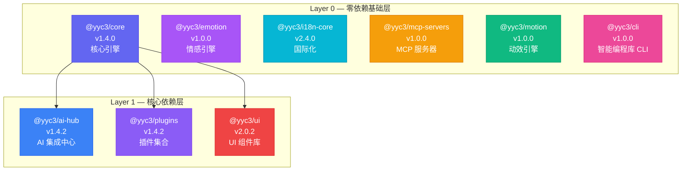

---

## 二、9 包矩阵总览

| #   | 包                    | 版本  | 定位           | 内部依赖 | 子路径导出                                     | 测试数 |
| --- | --------------------- | ----- | -------------- | -------- | ---------------------------------------------- | ------ |
| 1   | **@yyc3/core**        | 1.4.0 | 核心引擎       | 无       | `auth` `mcp` `skills` `ai-family` `multimodal` | 224    |
| 2   | **@yyc3/ai-hub**      | 1.4.2 | AI 集成中心    | core     | `family` `family-compass` `work`               | 272    |
| 3   | **@yyc3/emotion**     | 1.0.0 | 情感引擎       | 无       | `engine` `music-bridge` `event-bus`            | 64     |
| 4   | **@yyc3/i18n-core**   | 2.4.0 | 国际化引擎     | 无       | `cache` `plugins` `icu` `ai` `mcp`             | 443    |
| 5   | **@yyc3/ui**          | 2.0.2 | UI 组件库      | core     | `core` `components` `family` `themes` `shadcn` | 108    |
| 6   | **@yyc3/plugins**     | 1.4.2 | 插件集合       | core     | `lsp` `content`                                | 29     |
| 7   | **@yyc3/mcp-servers** | 1.0.0 | MCP 服务器     | 无       | `types` `registry`                             | 20     |
| 8   | **@yyc3/motion**      | 1.0.0 | 动效引擎       | 无       | `css` `waapi` `framer` `hooks` `components`    | 13     |
| 9   | **@yyc3/cli**         | 1.0.0 | 智能编程库 CLI | 无       | `.` (index)                                    | 733    |

**测试总计: 1,906 passed**

---

## 三、包详情架构图

### @yyc3/core — 核心引擎

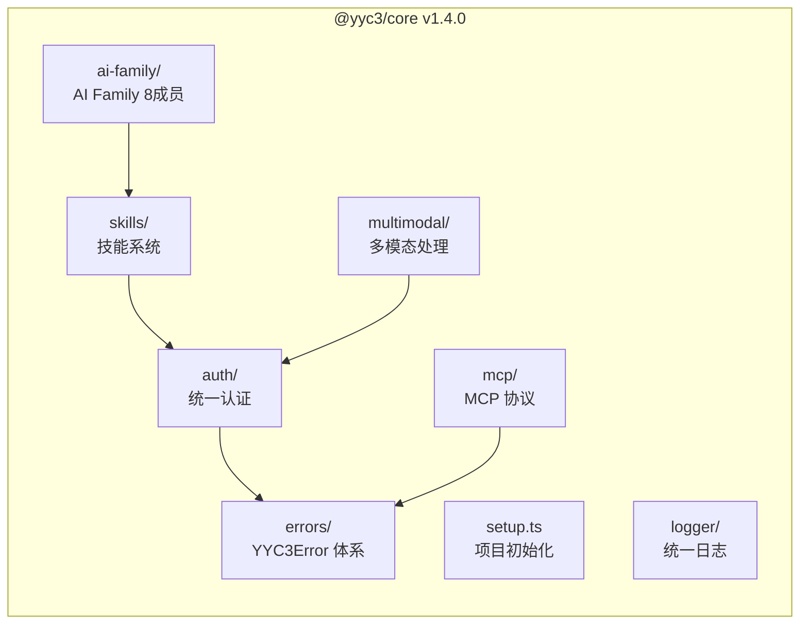

**子路径导出:**
```ts
import { ... } from '@yyc3/core'           // 全量导出
import { ... } from '@yyc3/core/auth'       // 认证 (Ollama/OpenAI/Unified)
import { ... } from '@yyc3/core/mcp'        // MCP Client/Transport
import { ... } from '@yyc3/core/skills'     // 技能管理/行业技能
import { ... } from '@yyc3/core/ai-family'  // 8 位 AI 家人管理
import { ... } from '@yyc3/core/multimodal' // 图像处理/多模态
```

---

### @yyc3/ai-hub — AI 集成中心

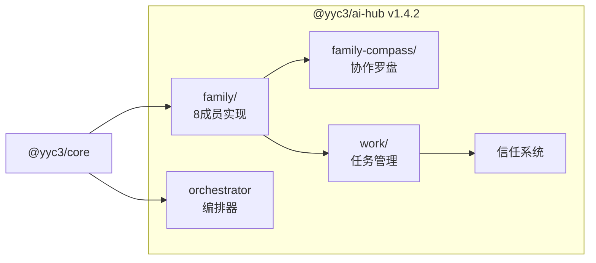

**子路径导出:**
```ts
import { ... } from '@yyc3/ai-hub'              // 全量
import { ... } from '@yyc3/ai-hub/family'        // 成员定义
import { ... } from '@yyc3/ai-hub/family-compass' // 协作罗盘
import { ... } from '@yyc3/ai-hub/work'           // 任务/信任管理
```

---

### @yyc3/emotion — 情感引擎

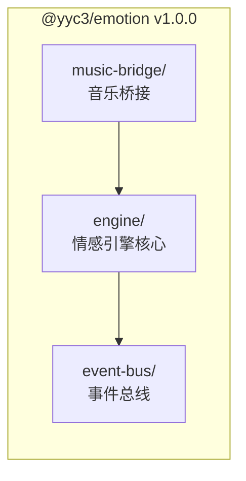

---

### @yyc3/i18n-core — 国际化引擎

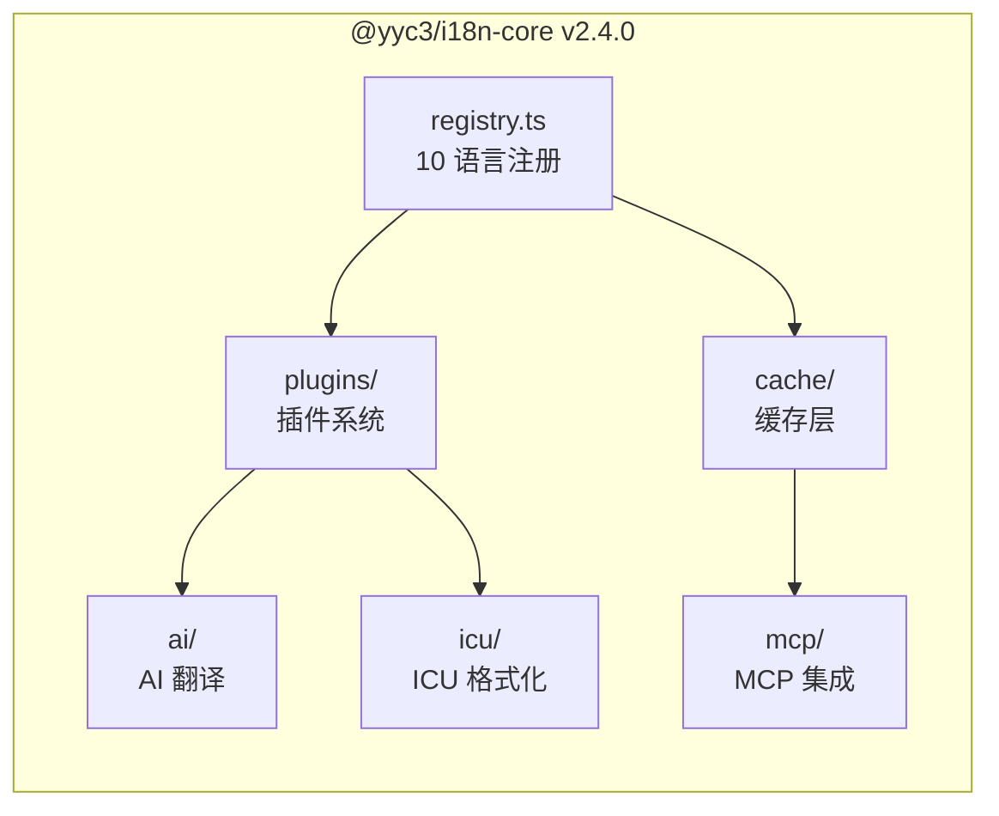

**支持语言:** zh-CN, zh-TW, en, ja, ko, fr, de, es, ar, pt-BR

---

### @yyc3/ui — UI 组件库

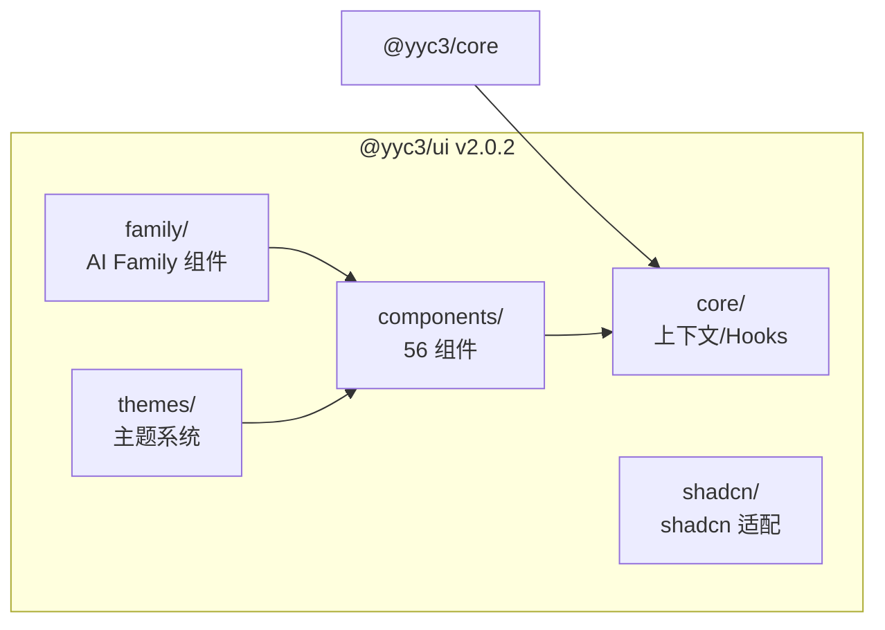

**56 个组件包括:** accordion, alert, avatar, badge, breadcrumb, button, calendar, card, carousel, chart, checkbox, collapsible, combobox, command, context-menu, dialog, drawer, dropdown-menu, form, hover-card, input, kbd, label, menubar, navigation-menu, pagination, popover, progress, radio-group, resizable, scroll-area, select, separator, sheet, sidebar, skeleton, slider, sonner, spinner, switch, table, tabs, textarea, toggle, tooltip, 等

---

### @yyc3/plugins — 插件集合

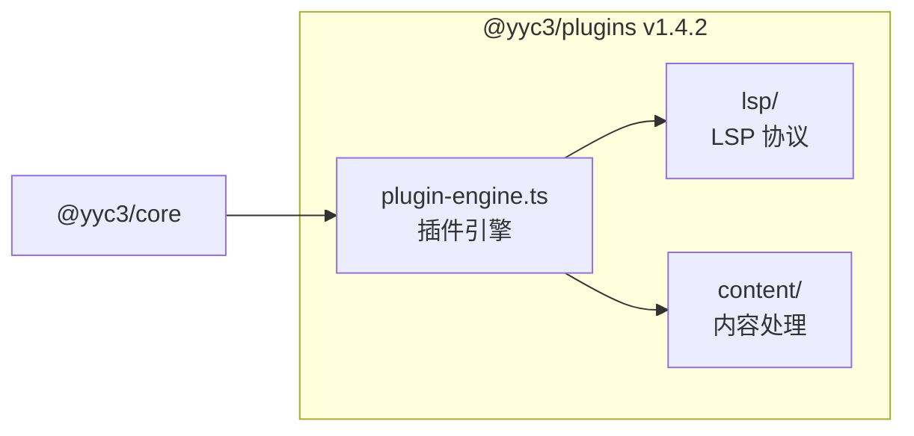

---

### @yyc3/mcp-servers — MCP 服务器

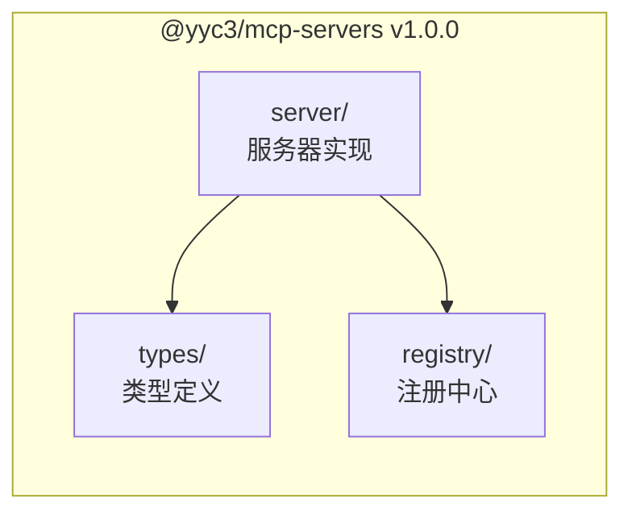

---

### @yyc3/motion — 三层动效引擎

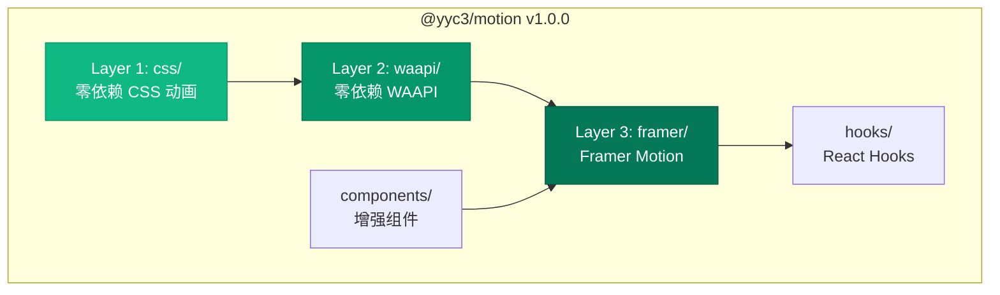

**增强组件:** Spotlight (鼠标聚光灯) · Card3D (3D 透视卡片) · ParticleCanvas (粒子网络) · SplineScene (Spline 懒加载)

---

### @yyc3/cli — 智能编程库 CLI

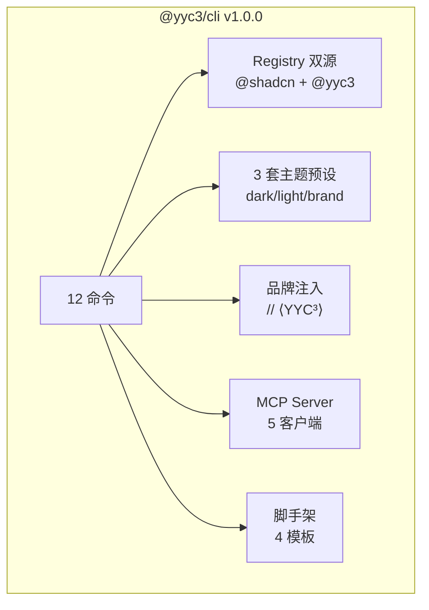

---

## 四、CLI 使用命令手册

### 安装

```bash
# 全局安装
pnpm add -g @yyc3/cli

# 或直接使用 npx
npx @yyc3/cli --help
```

### 初始化项目

```bash
# 交互式初始化
npx @yyc3/cli init

# 使用 YYC³ 主题预设
npx @yyc3/cli init -p yyc3-dark       # Cyberpunk 霓虹
npx @yyc3/cli init -p yyc3-light      # 明亮商务
npx @yyc3/cli init -p yyc3-brand      # 品牌标准

# 使用默认配置
npx @yyc3/cli init --defaults
```

### 添加组件

```bash
# 标准 shadcn 组件
npx @yyc3/cli add button
npx @yyc3/cli add card dialog sheet

# YYC³ 增强组件
npx @yyc3/cli add @yyc3/spotlight        # 鼠标聚光灯
npx @yyc3/cli add @yyc3/card-3d          # 3D 透视卡片
npx @yyc3/cli add @yyc3/particle-canvas  # 粒子网络背景
npx @yyc3/cli add @yyc3/spline-scene     # Spline 3D 场景
```

### 搜索组件

```bash
npx @yyc3/cli search button
npx @yyc3/cli search @yyc3              # 搜索所有 YYC³ 组件
npx @yyc3/cli list                       # 列出所有可用组件
```

### 脚手架创建项目

```bash
npx create-yyc3-app my-project
npx create-yyc3-app dashboard-app -t dashboard --preset yyc3-dark
npx create-yyc3-app ai-app -t ai-platform --preset yyc3-brand
npx create-yyc3-app landing -t landing --port 3200
npx create-yyc3-app api-server -t api
```

| 模板          | 说明                           | 默认端口 |
| ------------- | ------------------------------ | -------- |
| `dashboard`   | 侧边栏 + 内容区 + 数据表格     | 3201     |
| `ai-platform` | 对话界面 + 模型管理 + 工具调用 | 3300     |
| `landing`     | 品牌展示 + Spline 3D + 动效    | 3200     |
| `api`         | RESTful API + 认证 + 中间件    | 3400     |

### MCP 配置（AI 编辑器集成）

```bash
# 配置 MCP Server 到 AI 编辑器
npx @yyc3/cli mcp init --client cursor     # Cursor
npx @yyc3/cli mcp init --client vscode     # VS Code
npx @yyc3/cli mcp init --client claude     # Claude Code
npx @yyc3/cli mcp init --client codex      # Codex
npx @yyc3/cli mcp init --client opencode   # OpenCode
```

### 其他命令

```bash
npx @yyc3/cli diff button                  # 对比组件差异
npx @yyc3/cli docs button                  # 查看组件文档
npx @yc3/cli view @yyc3/spotlight          # 查看 Registry 组件详情
npx @yyc3/cli info                         # 获取当前项目信息
npx @yyc3/cli build                        # 构建自定义 Registry
npx @yyc3/cli registry                     # 管理 Registry 源
npx @yyc3/cli apply yyc3-dark              # 应用预设到现有项目
npx @yyc3/cli migrate                      # 运行迁移
```

---

## 五、运维指导

### 日常运维命令

```bash
# 构建
pnpm --filter @yyc3/<pkg> build           # 构建单个包
pnpm -r build                              # 构建全部包

# 类型检查
pnpm --filter @yyc3/<pkg> typecheck        # 单包类型检查
pnpm -r typecheck                          # 全部类型检查

# 测试
pnpm --filter @yyc3/<pkg> test             # 单包测试
pnpm -r test                               # 全部测试
pnpm --filter @yyc3/<pkg> test:coverage    # 带覆盖率测试

# 代码检查
pnpm --filter @yyc3/<pkg> lint             # 单包 lint
pnpm -r lint                               # 全部 lint
```

### 发布流程

```bash
# 1. 全量质量检查
pnpm -r build && pnpm -r typecheck && pnpm -r lint && pnpm -r test

# 2. 版本号升级（手动编辑或使用 node 脚本）
node -e "const f='packages/core/package.json',p=require(f);p.version='1.5.0';require('fs').writeFileSync(f,JSON.stringify(p,null,2)+'\n')"

# 3. 提交 + 打 Tag
git add -A && git commit -m "release: v1.5.0"
git tag v1.5.0
git push origin main --tags

# 4. CI/CD 自动发布（GitHub Actions）
# 或手动发布:
pnpm publish --filter @yyc3/core --access public --no-git-checks
```

### 发布前审核检查

```bash
# 使用审核脚本
node scripts/audit-publish.mjs
```

检查项：
- ✅ workspace: 协议残留（必须为 0）
- ✅ publishConfig access=public（9/9）
- ✅ files 字段包含 dist（9/9）
- ✅ 本地版本 > npm 版本

### 依赖更新

```bash
# 检查过时依赖
pnpm outdated -r

# 更新单个包依赖
pnpm --filter @yyc3/core update

# 全量更新
pnnpm update -r
```

### 故障排查

| 问题           | 命令                                                         |
| -------------- | ------------------------------------------------------------ |
| 构建失败       | `pnpm --filter @yyc3/<pkg> build 2>&1 \| grep error`         |
| 类型错误       | `pnpm --filter @yyc3/<pkg> typecheck`                        |
| 测试失败       | `pnpm --filter @yyc3/<pkg> test --reporter=verbose`          |
| workspace 泄漏 | `npm view @yyc3/<pkg> dependencies --json \| grep workspace` |
| npm 缓存       | `npm cache clean --force && pnpm store prune`                |
| 清理重装       | `rm -rf node_modules pnpm-lock.yaml && pnpm install`         |

### 版本号管理规范

| 变更类型   | 版本号         | 示例          |
| ---------- | -------------- | ------------- |
| Bug 修复   | patch (+0.0.1) | 1.4.0 → 1.4.1 |
| 新功能     | minor (+0.1.0) | 1.4.0 → 1.5.0 |
| 破坏性变更 | major (+1.0.0) | 1.4.0 → 2.0.0 |

---

## 六、Monorepo 工作空间结构

```
YYC3-π³/
├── packages/
│   ├── core/          ← @yyc3/core v1.4.0 (224 tests)
│   ├── ai-hub/        ← @yyc3/ai-hub v1.4.2 (272 tests)
│   ├── emotion/       ← @yyc3/emotion v1.0.0 (64 tests)
│   ├── i18n-core/     ← @yyc3/i18n-core v2.4.0 (443 tests)
│   ├── ui/            ← @yyc3/ui v2.0.2 (108 tests)
│   ├── plugins/       ← @yyc3/plugins v1.4.2 (29 tests)
│   ├── mcp-servers/   ← @yyc3/mcp-servers v1.0.0 (20 tests)
│   ├── motion/        ← @yyc3/motion v1.0.0 (13 tests)
│   ├── cli/           ← @yyc3/cli v1.0.0 (733 tests)
│   └── ide/           ← @yyc3/ide (private, 不发布)
├── docs-site/         ← docs.yyc3.top (VitePress)
├── scripts/           ← 审核/发布脚本
├── .github/workflows/ ← CI/CD (ci.yml, release.yml, docs.yml, packages-ci.yml)
├── pnpm-workspace.yaml
└── package.json       ← monorepo root
```

### CI/CD 流水线

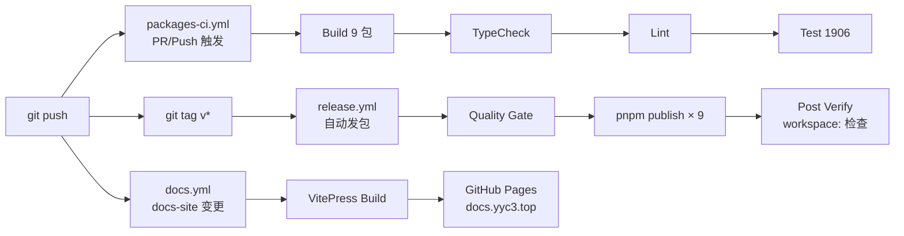

---

*本文档由 YYC³ Team 维护 · 最近更新: 2026-05-01 · [docs.yyc3.top](https://docs.yyc3.top)*
